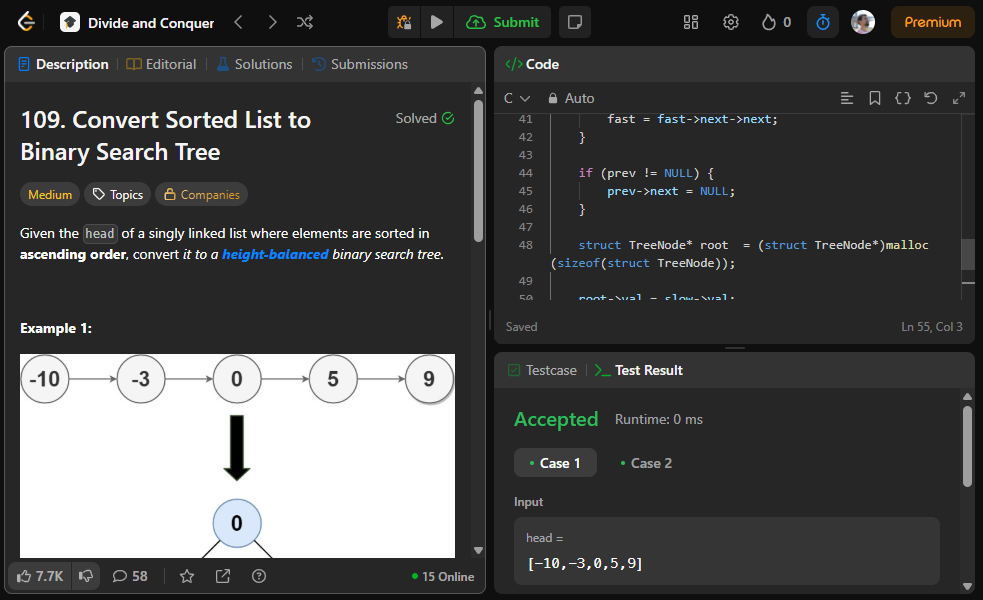
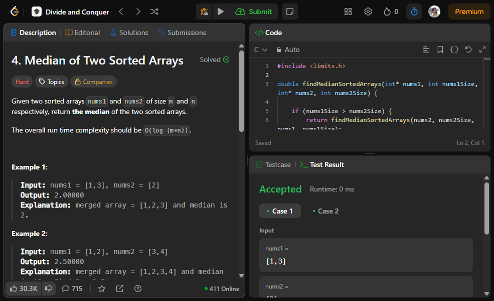

# D&C Exercícios

**Conteúdo da Disciplina**: Dividir e Conquistar 

## Alunos
|Matrícula | Aluno |
| -- | -- |
| 20/0059980  | Pedro Miguel Martins de Oliveira dos Santos |
| 21/1062910  |  Daniel Nunes Duarte |

## Sobre 

Nesse projeto resolvemos duas questões: Uma média e uma difícil.

A primeira questão é 4 de nível difícil é possível encontrar em https://leetcode.com/problems/median-of-two-sorted-arrays/description/?envType=problem-list-v2&envId=divide-and-conquer e ela trata sobre encontrar a mediana com dois arrays dados.

Já a segunda questão que é a questão 109 de nível médio em que realizamos a conversão de uma "sorted list" para uma "BST" e podemos verificar a questão aqui: https://leetcode.com/problems/convert-sorted-list-to-binary-search-tree/description/?envType=problem-list-v2&envId=divide-and-conquer

## Screenshots

## Instalação 
**Linguagem**: C 

## Uso 

1. Para utilizar as soluções é bastante simples. Em primeiro lugar encontre o código da questão que deseja verificar no repositório e copie.

2. Abra o site da questão referente no leetcode e depois cole o código no campo "code" dentro da página

3. Para realizar a compilação do código e seu teste aperte o botão "play na página que fica ao lado do botão "submit"

Obs.: Necessário estar logado na página LeetCode

