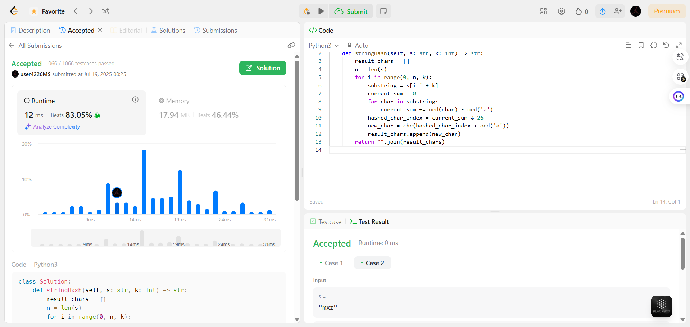
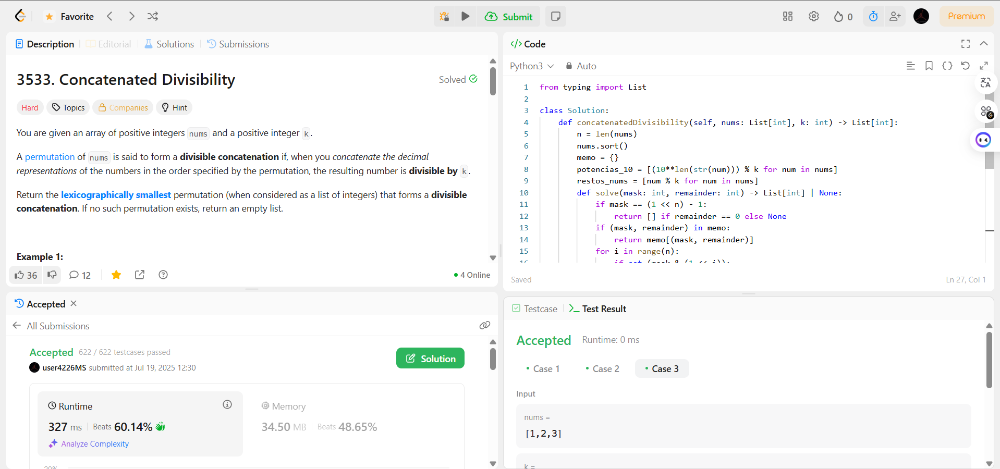

# D&C Exercícios

**Conteúdo da Disciplina**: Dividir e Conquistar 

## Alunos
|Matrícula | Aluno |
| -- | -- |
| 20/0059980  | Pedro Miguel Martins de Oliveira dos Santos |
| 21/1062910  |  Daniel Nunes Duarte |

## Sobre 

Nesse projeto resolvemos quatro questões: duas médias e duas difíceis.

- A primeira questão é a 4 de nível difícil, que pode ser encontrada em [Questão 4 - Difícil](https://leetcode.com/problems/median-of-two-sorted-arrays/description/?envType=problem-list-v2&envId=divide-and-conquer). Ela trata sobre encontrar a mediana de dois arrays ordenados utilizando o método de Dividir e Conquistar, resolvida em C.

- A segunda questão é a 109 de nível médio, que pode ser encontrada em [Questão 109 - Média](https://leetcode.com/problems/convert-sorted-list-to-binary-search-tree/description/?envType=problem-list-v2&envId=divide-and-conquer). Nela realizamos a conversão de uma "sorted list" para uma "BST" (árvore binária de busca balanceada), também resolvida em C.

- A terceira questão é a 3271 de nível médio, disponível em [Questão 3271 - Média](https://leetcode.com/problems/hash-divided-string/description/). Ela trata sobre a geração de um hash de string por blocos, resolvida em Python.

- A quarta questão é a 3533 de nível difícil, disponível em [Questão 3533 - Difícil](https://leetcode.com/problems/concatenated-divisibility/description/). O desafio consiste em encontrar a menor permutação lexicográfica de inteiros que, ao serem concatenados, formam um número divisível por k. A solução foi implementada em Python.

## Screenshots
### Hard

---
### Medium

---
### Hard

---
### Medium

---

## Instalação 
**Linguagens**: C e Python 

## Uso 

1. Para utilizar as soluções é bastante simples. Em primeiro lugar encontre o código da questão que deseja verificar no repositório e copie.

2. Abra o site da questão referente no leetcode e depois cole o código no campo "code" dentro da página

3. Para realizar a compilação do código e seu teste aperte o botão "play na página que fica ao lado do botão "submit"

Obs.: Necessário estar logado na página LeetCode

## Apresentação

Vídeo disponível em: [youtube](https://youtu.be/cr3y-GpyLoY)

